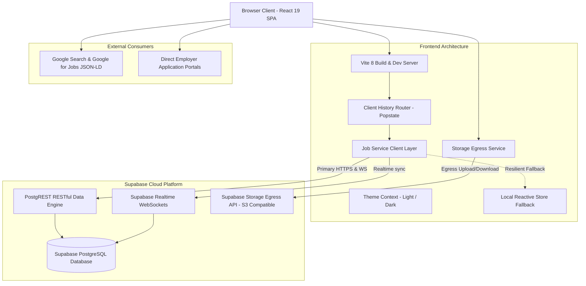

# Architecture & System Design Document
## Project: inaquired – Serverless Public Job Portal
**Document**: `architecture.md`  
**Architecture Style**: Serverless Jamstack + Supabase Realtime Backend + S3 Egress Storage  
**Target Environment**: Production / Cloud  

---

## 1. System Overview & Architecture Diagram



---

## 2. Infrastructure & Service Topology

| Layer | Provider / Tool | Configuration Details |
| :--- | :--- | :--- |
| **Frontend Framework** | React 19 + TypeScript | Strict TS typing, Vite 8 bundler, Tailwind CSS v4 |
| **Database** | Supabase PostgreSQL | Managed via environment variables |
| **Client API** | `@supabase/supabase-js` | Base URL configured via `.env` |
| **Publishable Key** | Supabase Auth/Anon Token | Configured via `.env` (`VITE_SUPABASE_ANON_KEY`) |
| **Storage Egress** | Supabase Storage S3 API | Configured via `.env` (`VITE_SUPABASE_STORAGE_URL`) |
| **Storage Bucket** | Object Storage Bucket | Bucket: `ap-northeast-1`, Region: `ap-northeast-1` |
| **Direct Postgres** | Direct Connection | Managed via `SUPABASE_DIRECT_URL` in `.env` |

---

## 3. Data Flow Architecture

### 3.1 Read Path (Job Discovery & Search)
1. On initial mount, `App.tsx` initializes `subscribeToPublishedJobs` from [`jobService.ts`](file:///c:/project/src/services/jobService.ts).
2. The service queries Supabase via PostgREST:
   ```ts
   supabase.from('jobs').select('*').eq('status', 'published').order('published_at', { ascending: false });
   ```
3. A WebSocket channel (`public:jobs`) is established listening to `postgres_changes`. Any database modification (inserts, updates, status changes) automatically updates connected clients with zero polling latency.
4. If network connectivity is severed or the Supabase endpoint is unavailable, the service automatically routes the request to [`offlineStore.ts`](file:///c:/project/src/services/offlineStore.ts), loading verified starter data without UI crashes.

### 3.2 Storage Egress Path (Job Assets & Documents)
1. File upload requests pass through [`storageService.ts`](file:///c:/project/src/services/storageService.ts).
2. Assets are transmitted to the Supabase S3 Egress endpoint:
   `https://wnpsrdtlqxfiglhmalwq.storage.supabase.co/storage/v1/s3/ap-northeast-1/attachments/...`
3. The service generates public, CDN-ready URLs formatted for candidate downloads and previews.

---

## 4. Entity Relationship Model & Database Schema

### 4.1 `public.jobs`
| Column | Type | Constraints / Description |
| :--- | :--- | :--- |
| `id` | `TEXT` | Primary key (`job_<timestamp>_<random>`) |
| `title` | `VARCHAR(150)` | Job posting title |
| `slug` | `VARCHAR(200)` | Unique URL-safe identifier |
| `company_name` | `VARCHAR(120)` | Hiring organization |
| `location` | `VARCHAR(200)` | Geo-location or "Remote" |
| `job_type` | `VARCHAR(50)` | `full-time`, `part-time`, `contract`, `internship` |
| `work_arrangement` | `VARCHAR(50)` | `remote`, `on-site`, `hybrid` |
| `category` | `VARCHAR(80)` | Engineering, Design, Product, etc. |
| `experience_level` | `VARCHAR(50)` | `entry`, `mid`, `senior`, `lead`, `internship` |
| `salary_min` | `NUMERIC` | Minimum annual compensation |
| `salary_max` | `NUMERIC` | Maximum annual compensation |
| `currency` | `VARCHAR(10)` | ISO currency code (default: `USD`) |
| `description` | `TEXT` | Comprehensive role description |
| `responsibilities` | `TEXT` | Key expectations |
| `requirements` | `TEXT` | Technical and operational prerequisites |
| `benefits` | `TEXT` | Compensation and lifestyle perks |
| `application_url` | `TEXT` | Direct external employer URL |
| `application_deadline` | `DATE` | Expiration date |
| `tags` | `TEXT[]` | Keyword search array |
| `status` | `VARCHAR(20)` | `published`, `draft`, `archived` |
| `featured` | `BOOLEAN` | Highlight on home page |
| `attachment_url` | `TEXT` | Supabase storage egress asset link |
| `created_at` | `TIMESTAMPTZ` | Record creation timestamp |
| `published_at` | `TIMESTAMPTZ` | Publication timestamp |

### 4.2 `public.subscribers`
- `id` (UUID): Unique subscriber ID.
- `endpoint` (TEXT): Browser client identifier or push endpoint.
- `categories` (TEXT[]): Opted-in categories.
- `subscribed_at` (TIMESTAMPTZ): Opt-in timestamp.

### 4.3 `public.audit_logs`
- `id` (UUID): Log entry ID.
- `admin_id` (VARCHAR): Actor identifier.
- `admin_email` (VARCHAR): Actor email.
- `action` (VARCHAR): Mutation type (`JOB_CREATED`, `JOB_UPDATED`, `JOB_DELETED`).
- `target_resource` (VARCHAR): Target record path.
- `details` (TEXT): Mutation specifics.
- `timestamp` (TIMESTAMPTZ): Immutable timestamp.

---

## 5. Security & Access Control Architecture

1. **Row Level Security (RLS)**:
   - Public anonymous requests can **only** read rows where `status = 'published'`.
   - Draft and archived records are invisible to public unauthenticated queries.
2. **Denial-of-Wallet Protections**:
   - Field length bounds enforced in PostgreSQL check constraints (e.g. `VARCHAR(150)` for title, `VARCHAR(120)` for company).
3. **No Candidate Authentication Overhead**:
   - Zero credentials, passwords, or session tokens stored on candidate machines, eliminating credential-stuffing and session-hijacking threat vectors.
